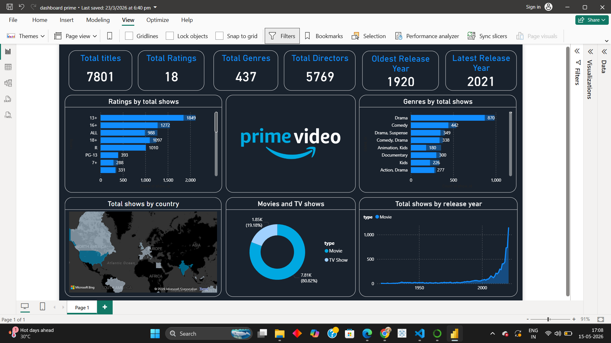

# amazon-prime-dashboard

# Amazon Prime Dashboard

## Overview
This project is an interactive Power BI dashboard created using the Amazon Prime Movies and TV Shows dataset.  
The dashboard provides insights into content distribution, genres, ratings, release trends, countries, and movie vs TV show analysis.

---

# Dashboard Preview

## Full Dashboard

## Filtered Dashboard

---

# Features
- KPI Cards
  - Total Titles
  - Total Ratings
  - Total Genres
  - Total Directors
  - Oldest Release Year
  - Latest Release Year

- Visualizations
  - Ratings by Total Shows
  - Genres by Total Shows
  - Total Shows by Country
  - Movies vs TV Shows
  - Total Shows by Release Year

- Interactive Filtering
- Dark Theme Dashboard Design
- Data Analysis using Power BI

---

# Tools & Technologies
- Power BI
- DAX
- Power Query
- Data Visualization
- Data Cleaning

---

# Dataset
Amazon Prime Movies and TV Shows Dataset

---

# Key Insights
- Drama is the most common genre.
- Movies dominate the platform content.
- Most content was released after 2000.
- Content production increased rapidly after 2015.

---

# Author
Prem Kumar
